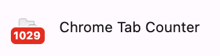

# Tabby 😸

i was using a tab counter but it didn't give me enough visibility into my tabs

roadmap:
- store dates tabs were first opened / last accessed    
    - ui and stuff: an hour ago, today, yesterday, month-day-year, or maybe always month-day-year...

- filter by date / time

- when hovering over tabs, there should be like a right arrow icon in a box indicating that it will bring you to it

- dedup option if possible to show same ones

- if it's the same as before, don't refresh the search result
because it looks jittery

- also when you go up and down with arrow keys, when you hold
down it's very laggy

- need to add arrow key support to tabs in the domain section

- add last accessed / first opened support to tabs in the domains section

the package size if 15mb. it's coming from
the .git and assets folder:
(base) mkieffer@MaxBook tabby % du -md 1 | sort -n
8       ./.git
8       ./assets
16      .